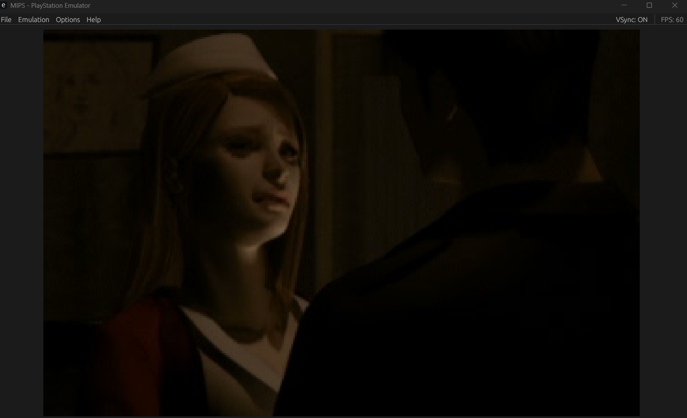

# MIPS (My internal PlayStation)

PS1 Emulator written in Rust.

*Tested on Silent Hill 1 (USA) CUE*

## Features
- Software scanline rasterizer
- Smooth 60+ FPS on release builds
- Gamepad and keyboard support

## Build and Run
### Prereqs
- I'm only using this on Windows 11, but I haven't checked if Linux works.
- Cargo
- CDC Firmware rom
- BIOS rom

1. Run cargo build making sure the target is msvc-x86_x64
2. Run the mips-desktop bin

## Thanks
- Lionel Flandrin for the Playstation Emulation Guide
- no$ for decades worth of PS1 knowledge
- Duckstation for practical emulation code

## Roadmap
- Hardware rasterizer (vulkan/wgpu)
- Multi-generation emulations (PS2, PS3, etc.)
- Actual UI for settings